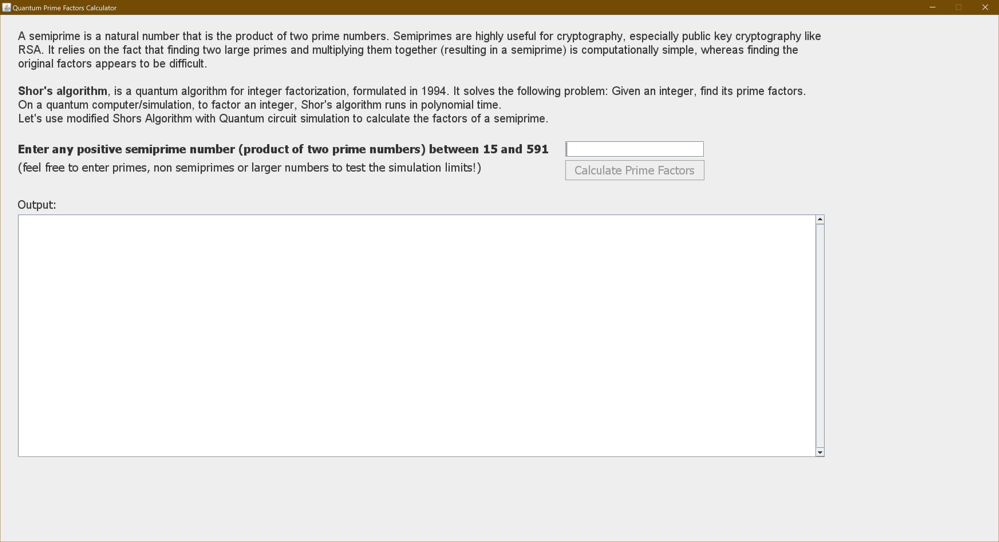
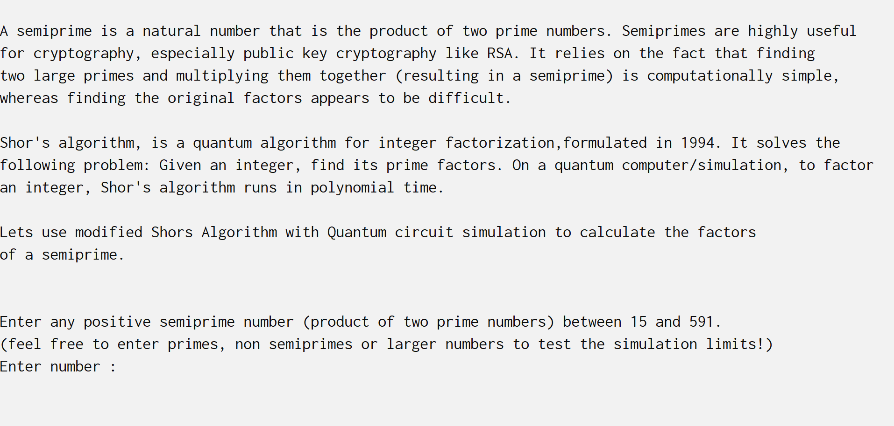

# Quantum Factorizer
An implementation of the Shor's algorithm with modifications to calculate the factors of a semi-prime.

Quantum simulators permit the study of quantum systems. Simulators are special purpose devices designed to provide insight into specific physics problems. In this project, I've developed an implementation of modified Shor's algorithm for Quantum Factorization. 
A semi-prime is a natural number that is the product of two prime numbers. Semi-primes are highly useful for cryptography, especially public key cryptography like RSA. Asymmetric key cryptography relies on the fact that finding two large primes and multiplying them together (resulting in a semiprime) is computationally simple, whereas finding the original factors appears to be difficult.

Shor's algorithm is a quantum algorithm for integer factorization, formulated in 1994. It solves the following problem: Given an integer, find its prime factors. On a quantum computer/simulation, to factor an integer, Shor's algorithm runs in polynomial time. Quantum simulators permit the study of quantum systems This project is an implementation of the aforementioned Shor's algorithm with modifications to calculate the factors of a semi-prime. 

From a software skills point of view, this project demonstrates the following:-

* Use of object-oriented concepts, which includes - java package, interface, class
* Use of software design patterns, which includes - [Command](https://en.wikipedia.org/wiki/Command_pattern), [Strategy](https://en.wikipedia.org/wiki/Strategy_pattern), [Observer](https://en.wikipedia.org/wiki/Observer_pattern), [Solid](https://en.wikipedia.org/wiki/SOLID), [Pipeline](https://www.cise.ufl.edu/research/ParallelPatterns/PatternLanguage/AlgorithmStructure/Pipeline.htm)
* User input and output capability
* Demonstrate Quantum Factorization in both GUI and Console mode.
* Version control using Git
* Use of automated build system based on maven
* Proper documentation with details on the project implementation and execution instruction in the readme.md file on git
* Documentation generated using JavaDocs functionality
* Use of Apache Log4j as a Java-based logging utility for keeping a log of the execution in a log file and inform user console
* Unit and integration testing 
* Use of Mocks and parameterized tests 
* Exception handling including custom exceptions

Please send your queries to me at aditimalviyathakur@gmail.com.

## Build the Application
The Simulator is built using Java 8 programming language and Spring. Maven is used to building the solution projects. Maven requires Java, so you must have Java installed in order to proceed.

To create a project assembly jar, simple change the directory to ```QuantumFactorizer/QuantumFactorizer``` and where "mvnw" or "mvnw.cmd" file is located, and then execute the normal package phase from the default lifecycle, as shown below

### Build without tests
```
# on Linux or Mac
./mvnw -Dmaven.test.skip=true clean package 
```

```
# on windows
mvnw.cmd -Dmaven.test.skip=true clean package 
```

### Build with tests
```
# on Linux or Mac
./mvnw clean package
```

```
# on windows
mvnw.cmd clean package
```

### Successful Build
A successfully built solution should look like the following
```
[INFO] ------------------------------------------------------------------------
[INFO] BUILD SUCCESS
[INFO] ------------------------------------------------------------------------
[INFO] Total time:  4.904 s
[INFO] Finished at: 2019-05-15T08:37:16Z
[INFO] ------------------------------------------------------------------------
```
and you will find a jar name ```QuantumFactorizer-1.0.jar``` created in the ```target``` folder. 

### Clean the built application
```
# on Linux or Mac
./mvnw clean
```

```
# on windows
mvnw.cmd clean
```

## Test the Application 
JUnit is used as the testing framework to implement tests for several modules and classes. In addition, Mockito mock framework is used in conjunction with JUnit to configure mock object for classes implementing an interface. Following instructions help you execute unit tests. 

```
# Run all the unit test classes (on linux)
./mvnw test

# Run all the unit test classes (on windows)
mvnw.cmd test

# Run a single test class (on linux)
./mvnw -Dtest=ShorAlgorithm test

# Run a single test class (on windows)
mvnw.cmd -Dtest=ShorAlgorithm test

# Run multiple test classes (on linux)
./mvnw -Dtest=ShorAlgorithm,ConsoleStrategyTest test

# Run multiple test classes (on windows)
mvnw.cmd -Dtest=ShorAlgorithm,ConsoleStrategyTest test

```

## Run the Application
The simulator can be run in two different modes
- GUI mode
- Command-line mode

### Run the Application in GUI Mode
In order to run the simulator in ```GUI``` mode, simply run the following command with **ui** as an argument to jar
```
# on Linux 
java -jar target/QuantumFactorizer-1.0.jar ui
```
```
# on Windows 
java -jar target\QuantumFactorizer-1.0.jar ui
```
The GUI simulator properly reader the interface only between the following ranges of your display resolutions.

* Minimum display resolution: 1200x800
* Maximum display resolution: 3840x2160

You can use input from [List of Semiprimes](https://prime-numbers.info/list/semiprimes) to test the application.

A snapshot of the GUI simulator interface look like the following



### Run the Application in Command-line Mode
In order to run the simulator in ```command line``` mode, simply run the following command
```
# on Linux 
java -jar target/QuantumFactorizer-1.0.jar
```
```
# on Windows 
java -jar target\QuantumFactorizer-1.0.jar
```
The command-line output look like



### Input and Output
A non-numerical or a decimal input e.g. ```text input``` will throw the following exception on Console
```
[ERROR] 2019-05-15 05:14:17.958 [main] ConsoleStrategy - Argument must be an integer, instead we got: text input
[ERROR] 2019-05-15 05:14:17.959 [main] ConsoleStrategy - This caused the error below
[FATAL] 2019-05-15 05:14:17.960 [main] ConsoleStrategy - For input string: "text input"
```
On the GUI interface, the exception will look like the following
```diff
- The argument must be an integer, instead, we got: text input
```
Successful execution will result in the following input (e.g. the input number is 133)
```
Result: The factors of n 133  are 7 and 19
Execution time in nanoseconds: 99997700
Execution time in milliseconds: 99
Execution time in seconds: 0
Execution time in minutes: 0
```

## Application Logging
The simulator implements Apache Log4j as a Java-based logging utility for keeping a log of the execution in a log file. This log file ```app.log``` is stored in a directory ```logs``` next to the jar.

## Documentation
All classes are documented using Javadoc notations. In addition, a readme is written that provides general details about the application. 
### API documentation
The Javadoc of this project is located in ```/src/main/doc/``` folder.
### Readme
The readme file is located [here](https://github.com/adimath/QuantumFactorizer/blob/master/README.md). It has a detailed description of the quantum factorization application and software development methodologies used.  

## References
1. [Shor's Algorithm](https://en.wikipedia.org/wiki/Shor%27s_algorithm)
2. [Gernot Schaller and Ralf Schützhold. 2010. The role of symmetries in adiabatic quantum algorithms. Quantum Info. Comput. 10, 1 (January 2010), 109-140.](https://dl.acm.org/citation.cfm?id=2011438.2011447)
3. [Shor's factoring algorithm](https://www.quantiki.org/wiki/shors-factoring-algorithm)
4. [QC — Period finding in Shor’s Algorithm](https://medium.com/@jonathan_hui/qc-period-finding-in-shors-algorithm-7eb0c22e8202)
5. [Smolin, J. A., Smith, G., & Vargo, A. (2013). Oversimplifying quantum factoring. Nature, 499(7457), 163–165.](https://doi.org/10.1038/nature12290)
6. [The Pipeline Pattern — for fun and profit](https://medium.com/@aaronweatherall/the-pipeline-pattern-for-fun-and-profit-9b5f43a98130)
7. [Tim Evans, Quantum Field Theory Fourier Transforms, Delta Functions and Theta Functions](https://www.imperial.ac.uk/media/imperial-college/research-centres-and-groups/theoretical-physics/msc/current/qft/handouts/qftdeltafunction.pdf)
8. [Lu, C.-Y., Browne, D. E., Yang, T., & Pan, J.-W. (2007). Demonstration of a Compiled Version of Shor’s Quantum Factoring Algorithm Using Photonic Qubits. Physical Review Letters, 99(25), 250504.](https://doi.org/10.1103/PhysRevLett.99.250504)
9. [Lanyon, B. P., Weinhold, T. J., Langford, N. K., Barbieri, M., James, D. F. V., Gilchrist, A., & White, A. G. (2007). Experimental Demonstration of a Compiled Version of Shor’s Algorithm with Quantum Entanglement. Physical Review Letters, 99(25), 250505.](https://doi.org/10.1103/PhysRevLett.99.250505)
10. [Vazirani, Quantum algorithms](https://people.eecs.berkeley.edu/~vazirani/algorithms/chap10.pdf)
11. [Burges, C. J. C. (2002, January 1). Factoring as Optimization.](https://www.microsoft.com/en-us/research/publication/factoring-as-optimization/)
12. [Artur Ekert, Patrick Hayden and Hitoshi Inamori, Basic concepts in quantum computation](https://arxiv.org/pdf/quant-ph/0011013.pdf)
13. [Shor’s order (period) finding algorithm and factoring](https://inst.eecs.berkeley.edu/~cs191/fa05/lectures/lecture19_fa05.pdf)
14. [Li, J., Peng, X., Du, J., & Suter, D. (2012). An efficient exact quantum algorithm for the integer square-free decomposition problem. Scientific Reports, 2(1), 260. https://doi.org/10.1038/srep00260](https://www.nature.com/articles/srep00260)
15. [QFT, Period Finding & Shor’s Algorithm](https://courses.edx.org/c4x/BerkeleyX/CS191x/asset/chap5.pdf)
16. [John Watrous's Lecture Notes](https://cs.uwaterloo.ca/~watrous/LectureNotes.html)
17. [Continued Fraction](http://mathworld.wolfram.com/ContinuedFraction.html)
18. [Quantum Field Theory Fourier Transforms, Delta Functions and Theta Functions](https://www.imperial.ac.uk/media/imperial-college/research-centres-and-groups/theoretical-physics/msc/current/qft/handouts/qftdeltafunction.pdf)
19. [Danielson-Lanczos Lemma](http://mathworld.wolfram.com/Danielson-LanczosLemma.html)
20. [Polynomial-Time Algorithms for Prime Factorization and Discrete Logarithms on a Quantum Computer](https://arxiv.org/abs/quant-ph/9508027)
21. [Martín-López, E., Laing, A., Lawson, T., Alvarez, R., Zhou, X.-Q., & O’Brien, J. L. (2012). Experimental realization of Shor’s quantum factoring algorithm using qubit recycling. Nature Photonics, 6(11), 773–776.](https://doi.org/10.1038/nphoton.2012.259)
